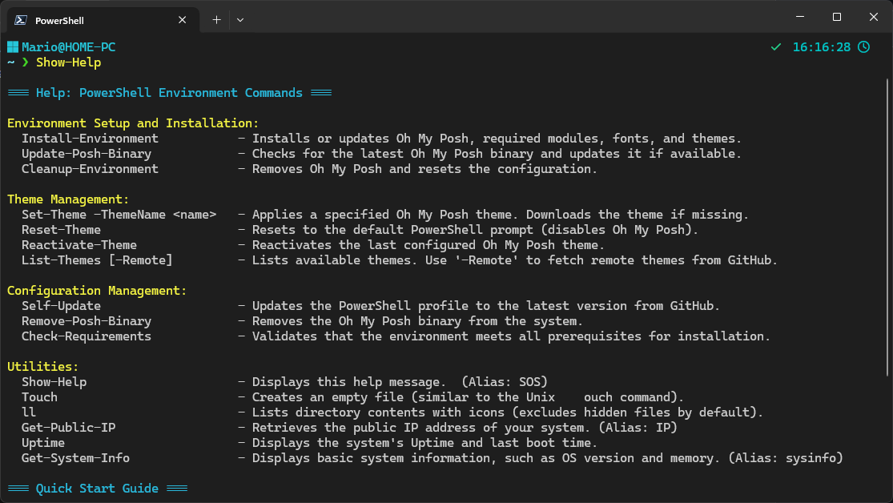

# 🚀 PowerShell 7 Profile Setup with Oh My Posh 🎨

---

⚠️ **Global Testing Phase** ⚠️  
We are currently in a global testing phase. If you encounter any issues, please report them in the [Issues Section](https://github.com/mdelacruzperu/oh-my-posh-powershell7/issues). Your feedback is invaluable and will help us improve!

---

Transform your PowerShell experience with this comprehensive script, designed to set up **Oh My Posh** and customize your terminal environment like a pro! Whether you're a developer, system administrator, or just a terminal enthusiast, this script automates the process to save you time and effort.

---

## 📋 Features

- Automatically installs and configures **Oh My Posh**.
- Validates that you have **PowerShell 7** or higher installed.
- Downloads and applies **Nerd Fonts** for a stunning terminal look.
- Installs useful PowerShell modules like **Terminal-Icons**.
- Manages themes, including downloading and caching from remote sources.
- Allows easy customization and resetting of your PowerShell prompt.
- Offers user-friendly utilities like system info, uptime, and more.

---

## 🚦 Requirements

Before using this script, ensure you meet the following requirements:

1. **PowerShell 7 or higher**  
   - Download from [PowerShell GitHub](https://github.com/PowerShell/PowerShell).  
   - Follow the instructions for your operating system.

2. **Internet Connection**  
   - Required for downloading Oh My Posh, themes, and fonts.

3. **Execution Policy**  
   - Ensure your PowerShell execution policy allows running scripts:
     ```powershell
     Set-ExecutionPolicy -Scope CurrentUser -ExecutionPolicy RemoteSigned
     ```

---

## 🔧 Installation

### **Option 1: Run the script directly**
Run this one-liner in PowerShell 7 to download and execute the script:

```powershell
irm "https://raw.githubusercontent.com/mdelacruzperu/oh-my-posh-powershell7/main/install-profile.ps1" | iex
```

### **Option 2: Clone and run**
If you prefer to review the script before running it:

1. Clone the repository:
   ```bash
   git clone https://github.com/mdelacruzperu/oh-my-posh-powershell7.git
   cd oh-my-posh-powershell7
   ```

2. Run the script:
   ```powershell
   ./install-profile.ps1 -Local
   ```

---

## 🛠 What the script does

1. **Checks requirements:** Ensures PowerShell 7 or higher is installed.  
2. **Downloads and installs Oh My Posh:** Fetches the latest binary.  
3. **Sets up Nerd Fonts:** Downloads and prepares fonts for use in your terminal.  
4. **Installs PowerShell modules:** Includes tools like **Terminal-Icons**.  
5. **Manages themes:** Downloads default themes and lets you apply or reset them easily.  
6. **Customizes the environment:** Configures a personalized PowerShell profile.

---

## 🖼 Preview




---

## 💡 Usage

Once installed, you can use the following commands to manage your environment:

### **Key Commands**
- `Install-Environment`: Installs or updates Oh My Posh and related components.
- `Set-Theme -ThemeName <name>`: Applies a specific theme (e.g., `Set-Theme -ThemeName peru`).
- `Reset-Theme`: Resets to the default PowerShell prompt.
- `Reactivate-Theme`: Reapplies the last configured theme.
- `Cleanup-Environment`: Removes all customizations and resets to default.
- `List-Themes [-Remote]`: Lists available themes. Use `-Remote` to fetch remote themes from GitHub.
- `Update-Posh-Binary`: Updates the Oh My Posh binary to the latest version.
- `Self-Update`: Updates the PowerShell profile to the latest version from GitHub.

---

## 📚 Advanced Utilities

This script includes additional utilities for daily productivity:

- `ll`: Lists directory contents with file icons.
- `sysinfo`: Displays system information.
- `uptime`: Shows system uptime and last boot time.
- `ip`: Retrieves the public IP address of your system.

---

## 🤝 Contributing

Feel free to fork this repository, make improvements, and submit a pull request. We welcome your ideas and contributions to make this project even better!

---

## Support the Project
If you find this project useful, consider supporting it by [donating via PayPal](https://paypal.me/mdelacruzperu). Your support helps keep this project alive! 💙

[](https://paypal.me/mdelacruzperu)

---

## 🔗 More Resources

- **Oh My Posh Documentation:** [https://ohmyposh.dev/](https://ohmyposh.dev/)
- **PowerShell Documentation:** [https://learn.microsoft.com/en-us/powershell/](https://learn.microsoft.com/en-us/powershell/)
